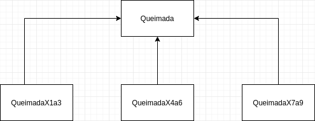

# Prova Trabalho - POO II

Você tem acompanhado a quantidade de queimadas que temos visto ultimamente? Com estes acontecimentos, alguns pesquisadores estão cada vez mais relatando dados sobre as queimadas. Nesta prova-trabalho você deverá ler os dados das queimadas disponível no Google Classroom. Um arquivo contém as informações do data set e outro arquivp contém o data set propriamente dito.

Você deverá criar um código OO que armazene as informações sobre cada queimada. Deverá portanto fazer a leitura do data set instanciando os objetos. As queimadas são classificadas de acordo com a área de acontecimento, veja o diagrama abaixo:

Para cada queimada, você deverá armazená-la em um Pilha do mês correspondente. Sendo portanto 12 pilhas existentes no seu código. Você se lembra do Tipo Abstrato de Dados Pilha? Pilha é uma estrutura de dados do tipo LIFO(Last-In-First-Out) em que o último elemento a entrar é o primeiro a sair. Por definição as operações básicas de uma pilha são empilhar e desempilhar. Nesta prova-trabalho você não poderá usar Queue existente de Java, implementando sua própria.

Quando tiver todos os objetos em memória separados pelas pilhas mensais, faça um relatório (pode ser um print) do resultado encontrado por mês. Observe se algo a mais pode ser classificado ou avaliado nos seus dados.

### Critérios de avaliação:

a) Uso de uma interface PilhaTAD que garanta as duas operações básicas de empilhar e desempilhar como comportamento da classe da letra 'b'.  
b) Uso de uma classe Pilha para representar o TAD e que implemente a interface da letra 'a'.  
c) Uso de exceções próprias que podem ocorrer na classe Pilha.  
d) Uso correto de visibilidade dos atributos, métodos, de contrutores, interface, herança, polimorfismo e classe abstrata, se forem o caso.  
e) Uso de alocação dinâmica.  
f) Extra: Registro das exceções que ocorrerem em arquivo log(txt) e relatório em arquivo.

### Descrição das classes utilizadas

#### AllBurns.java

Classe responsável por gerenciar o ArrayList de Pilhas de cada mês.
Ela segue um padrão de projeto chamado Singleton. Este padrão garante a existência de
apenas uma instância de uma classe, mantendo um ponto global de acesso ao seu
objeto.

#### Burn.java

Superclasse responsável por mapear os parâmetros das queimadas de maneira geral.
Suas Subclasses são: BurnX1to3, BurnX4to6 e BurnX7to9.

#### BurnX1to3.java, BurnX4to6.java e BurnX7to9.java

Cada uma é uma subclasse de Burn.java. Sua condição de construção é a coordenada X
estar no intervalo correto descrito em seu nome.

#### EmptyStackException.java

Exceção que trata a tentativa do usuário remover um item de uma lista vazia. Ela utilziada
no método pop() da classe Stack.

#### FileHandler.java

Classe responsável por ler e escrever os arquivos csv do projeto. Ela também define os
tipos de relatório a serem gerados de acordo com a entrada do usuário.

#### LogWriter.java

Classe responsável por salvar todas as exceções que acontecerem durante a execução
da aplicação.

#### Month.java

Enum dos meses do ano definido pelos valores de 0 a 11. Essa classe é utilizada no
método getMonthlyBurns() da classe FileHandler.java. Utilizamos para criar o nome dos
arquivos de relatório de cada mês.

#### Node.java

Classe que representa um item da Pilha. É utilizada na classe Stack.java.

#### ProvaTrabalho.java

Classe principal do projeto.

#### Stack.java

Implementação da estrutura de dados Pilha FIFO. Perceba que essa classe foi
implementada de maneira genérica, ou seja, pode ser instanciada pilhas de qualquer tipo
de dados.

#### StackADT (Abstract Data Type)

Interface onde é definida as assinaturas dos métodos da classe Stack.java

#### WrongCoordinateException.java

Exceção que trata a coordenada X correta de sua respectiva classe.
